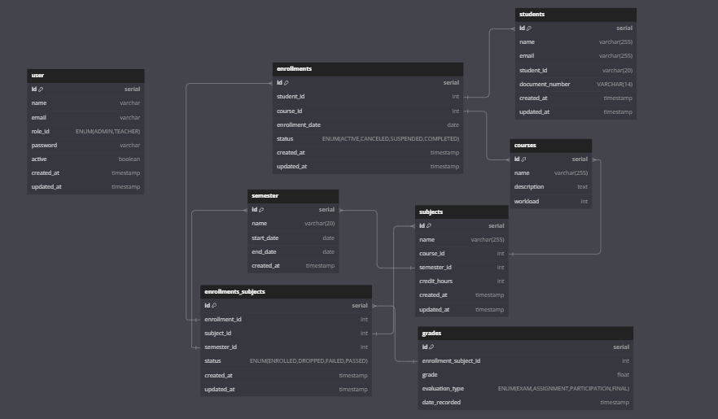

# Arquitetura Utilizada

## Front-end:

-   **Vue**: Framework progressivo utilizado com TypeScript para uma melhor estruturação do código e manutenção.
-   **Pinia**: Gerenciador de estado global leve e eficiente, permitindo o compartilhamento de dados entre componentes.
-   **Vuetify**: Biblioteca de componentes UI baseada no Material Design, facilitando a criação de interfaces responsivas e acessíveis.
-   **Axios**: Cliente HTTP utilizado para consumir as APIs de forma eficiente.
-   **SnackBar**: Utilizado para exibir notificações de erro e sucesso, garantindo uma melhor experiência do usuário.

## Back-end:

-   **TypeScript**: Escolhido por sua forte tipagem estática, que melhora a manutenção do código e a integração com os modelos do Prisma.
-   **Joi**: Utilizado para validação de dados de entrada, garantindo maior segurança e evitando entradas inválidas no sistema.
-   **dotenv**: Responsável pelo gerenciamento de variáveis de ambiente, facilitando a configuração e segurança de credenciais.
-   **Express**: Framework minimalista e eficiente para a construção da API, permitindo escalabilidade e flexibilidade.
-   **jsonwebtoken**: Ferramenta essencial para a autenticação baseada em tokens JWT, garantindo a segurança das sessões.
-   **BCrypt**: Utilizado para criptografar senhas.
-   **Prisma**: ORM robusto que simplifica a comunicação com o banco de dados e ajuda na prevenção de SQL Injection.
-   **Jest**: Escolhido para a implementação de testes automatizados, assegurando a confiabilidade do código.

A arquitetura do backend foi projetada de forma modular e bem organizada, seguindo um modelo próximo ao **MVC (Model-View-Controller) + Service Layer + Repository Pattern**. Isso garante uma separação clara de responsabilidades e facilita a manutenção e escalabilidade do sistema. A estrutura do projeto foi organizada da seguinte maneira:

-   **config/**: Contém arquivos de configuração do sistema, incluindo variáveis de ambiente e definições globais.
-   **controllers/**: Gerencia as requisições HTTP, direcionando as chamadas para os serviços apropriados.
-   **errors/**: Centraliza o tratamento de erros personalizados para padronização das respostas de erro.
-   **middlewares/**: Conjunto de middlewares para autenticação, validação de dados e manipulação de requisições.
-   **protocols/**: Define interfaces e tipos para garantir a consistência na comunicação entre camadas.
-   **repositories/**: Responsável pela comunicação direta com o banco de dados, abstraindo as operações de persistência.
-   **routers/**: Gerencia as definições de rotas da aplicação e suas respectivas associações com os controllers.
-   **schemas/**: Conjunto de validações de entrada utilizando Joi para garantir a integridade dos dados recebidos.
-   **services/**: Contém a lógica de negócios da aplicação, garantindo que os controllers permaneçam enxutos.
-   **utils/**: Funções auxiliares reutilizáveis em diferentes partes do sistema.

## GIT e CI/CD

No Git, foi adotada uma estratégia de ramificação onde cada **task/história** possui sua própria **branch** dedicada. Além disso, foram definidas duas branches principais:

- **master**: Destinada ao ambiente de produção. Apenas código estável e validado é integrado nela. O deploy para produção (CD) ainda não está automatizado, sendo necessário envio manual.
- **develop**: Destinada ao ambiente de homologação. Todo código integrado nela é automaticamente disponibilizado no ambiente de homologação acessível em: [http://64.23.236.72/](http://64.23.236.72/)

Foi implementado um **CI (Integração Contínua)** que realiza a execução automática de todos os **testes unitários** antes do merge. Além disso, a pipeline verifica se o **build da aplicação é bem-sucedido**, garantindo que o deploy não seja quebrado por falhas no código. Dessa forma, qualquer problema pode ser identificado e corrigido antes da fusão das branches.

## Banco de Dados

O schema do banco de dados foi projetado pensando na escalabilidade do projeto. A modelagem segue um padrão relacional bem estruturado, permitindo um gerenciamento eficiente das entidades e relacionamentos. O banco de dados utiliza **PostgreSQL**, e o Prisma foi escolhido como ORM para facilitar a interação com os dados e evitar vulnerabilidades como SQL Injection.

A estrutura inclui as seguintes entidades principais:

-   **Users**: Representa os usuários do sistema, diferenciando papéis como administradores e professores.
-   **Students**: Contém informações dos alunos cadastrados, incluindo e-mail e número de registro.
-   **Courses**: Armazena os cursos oferecidos, juntamente com suas descrições e carga horária.
-   **Subjects**: Relacionadas a cursos e semestres, com informações sobre créditos e alocação.
-   **Enrollments**: Representa as matrículas dos alunos nos cursos, permitindo diferentes status (ativo, cancelado, etc.).
-   **EnrollmentsSubjects**: Gerencia a relação entre matrículas e disciplinas, armazenando o status de cada aluno em uma disciplina específica.
-   **Semester**: Mantém os períodos acadêmicos organizados por datas de início e fim.
-   **Grades**: Mantém as notas dos alunos, associadas a avaliações específicas.

Segue abaixo a representação visual do schema:

**OBS:** No momento, apenas as funcionalidades de usuários e alunos foram implementadas.

## Deploy:

Para o deploy, utilizei **Docker** com **Docker Compose** para automatizar e facilitar o processo de CD. Além disso, configurei um runner do GitHub para realizar o deploy na VPC da Digital Ocean. A aplicação está hospedada no seguinte link: [Ambiente de homologação](http://64.23.236.72/)

## Organização e Metodologia de Desenvolvimento

Para gerenciar o desenvolvimento do projeto, utilizei o **Jira** como ferramenta de organização, aplicando a metodologia **Scrum**.

Na **primeira sprint**, foquei na implementação das principais funcionalidades solicitadas.

Na **segunda sprint**, priorizei a documentação e o deploy da aplicação.

## Melhorias futuras:

Caso houvesse mais tempo disponível para desenvolvimento, eu implementaria as seguintes melhorias:

-   Implementar a filtragem no backend, em vez de processá-la no frontend.
-   Continuação das features, permitindo que um estudante faça login na plataforma, se matricule em cursos e visualize suas notas.
-   Implementação de funcionalidades para um administrador criar novos cursos e semestres.
-   Documentação da API utilizando **Swagger**.
-   Melhorias na interface e na responsividade do site.
-   Configuração do **CD** para o ambiente de produção.
-   Implementação de novos **testes de integração**, garantindo maior segurança e prevenção de erros na API.
-   Implementar o modo escuro no front-end.
-   Adicionar suporte a múltiplos idiomas.

